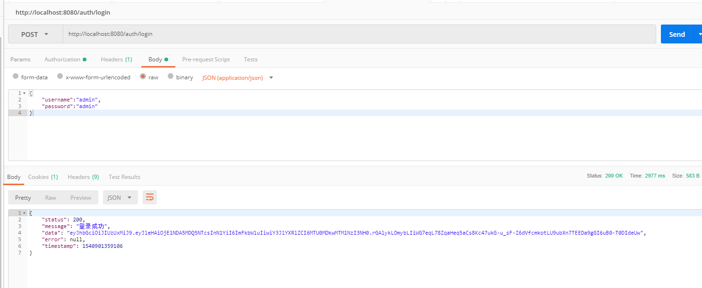
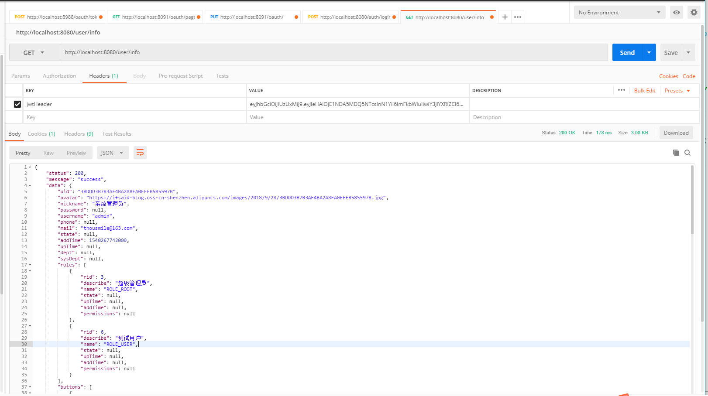

## 下面开始spring boot 工程的搭建 POM文件的主要依赖**

```java
<dependencies>

        <dependency>
            <groupId>org.springframework.boot</groupId>
            <artifactId>spring-boot-starter-web</artifactId>
        </dependency>

        <dependency>
            <groupId>org.mybatis.spring.boot</groupId>
            <artifactId>mybatis-spring-boot-starter</artifactId>
            <version>1.3.2</version>
        </dependency>

        <dependency>
            <groupId>com.github.pagehelper</groupId>
            <artifactId>pagehelper-spring-boot-starter</artifactId>
            <version>1.2.5</version>
        </dependency>

        <dependency>
            <groupId>mysql</groupId>
            <artifactId>mysql-connector-java</artifactId>
            <scope>runtime</scope>
        </dependency>

        <dependency>
            <groupId>org.springframework.boot</groupId>
            <artifactId>spring-boot-configuration-processor</artifactId>
            <optional>true</optional>
        </dependency>

        <dependency>
            <groupId>org.projectlombok</groupId>
            <artifactId>lombok</artifactId>
            <optional>true</optional>
        </dependency>

        <dependency>
            <groupId>org.springframework.boot</groupId>
            <artifactId>spring-boot-starter-test</artifactId>
            <scope>test</scope>
        </dependency>

        <dependency>
            <groupId>org.apache.commons</groupId>
            <artifactId>commons-lang3</artifactId>
            <version>3.7</version>
        </dependency>

        <!-- ————————————— security开始————————————————————— -->
        <dependency>
            <groupId>org.springframework.boot</groupId>
            <artifactId>spring-boot-starter-security</artifactId>
        </dependency>

        <dependency>
            <groupId>io.jsonwebtoken</groupId>
            <artifactId>jjwt</artifactId>
            <version>0.9.0</version>
        </dependency>

    </dependencies>
```

### 然后在application.yml文件中添加jwt的配置

```

jwt: 
  header: jwtHeader   #jwt的请求头
  secret: eyJleHAiOjE1NDMyMDUyODUsInN1YiI6ImFkbWluIiwiY3Jl   #jwt的加密字符串
  expiration: 3600000   #jwt token有效时间（毫秒）
  route:
    login: /auth/login    #登录地址
    refresh: /auth/refresh  #刷新token地址
    register: /auth/register  #注册的地址
```

### **JwtUser类   显示spring security 规定的 UserDetails 接口**

```
package com.ifsaid.admin.common.jwt;

import com.fasterxml.jackson.annotation.JsonIgnore;
import org.springframework.security.core.GrantedAuthority;
import org.springframework.security.core.userdetails.UserDetails;

import java.util.Collection;

/**
 * @author: Wang Chen Chen
 * @Date: 2018/10/29 14:08
 * @describe：
 * @version: 1.0
 */
public class JwtUser implements UserDetails {

    private String username;

    private String password;

    private Integer state;

    private Collection<? extends GrantedAuthority> authorities;

    public JwtUser() {
    }

    public JwtUser(String username, String password, Integer state, Collection<? extends GrantedAuthority> authorities) {
        this.username = username;
        this.password = password;
        this.state = state;
        this.authorities = authorities;
    }

    @Override
    public String getUsername() {
        return username;
    }

    @JsonIgnore
    @Override
    public String getPassword() {
        return password;
    }

    @Override
    public Collection<? extends GrantedAuthority> getAuthorities() {
        return authorities;
    }

    @JsonIgnore
    @Override
    public boolean isAccountNonExpired() {
        return true;
    }

    @JsonIgnore
    @Override
    public boolean isAccountNonLocked() {
        return state == 1;
    }

    @JsonIgnore
    @Override
    public boolean isCredentialsNonExpired() {
        return true;
    }

    @JsonIgnore
    @Override
    public boolean isEnabled() {
        return true;
    }
}

```

### **创建JwtTokenUtil 的工具类**

```java
package com.ifsaid.admin.common.jwt;

import io.jsonwebtoken.Claims;
import io.jsonwebtoken.Jwts;
import io.jsonwebtoken.SignatureAlgorithm;
import lombok.Data;
import org.springframework.beans.factory.annotation.Value;
import org.springframework.boot.context.properties.ConfigurationProperties;
import org.springframework.security.core.userdetails.UserDetails;
import org.springframework.stereotype.Component;

import java.io.Serializable;
import java.util.Date;
import java.util.HashMap;
import java.util.Map;

/**
 * @author: Wang Chen Chen
 * @Date: 2018/10/29 14:10
 * @describe：
 * @version: 1.0
 */

@Data
@ConfigurationProperties(prefix = "jwt")
@Component
public class JwtTokenUtil implements Serializable {

    private String secret;

    private Long expiration;

    private String header;

    /**
     * 从数据声明生成令牌
     *
     * @param claims 数据声明
     * @return 令牌
     */
    private String generateToken(Map<String, Object> claims) {
        Date expirationDate = new Date(System.currentTimeMillis() + expiration);
        return Jwts.builder().setClaims(claims).setExpiration(expirationDate).signWith(SignatureAlgorithm.HS512, secret).compact();
    }

    /**
     * 从令牌中获取数据声明
     *
     * @param token 令牌
     * @return 数据声明
     */
    private Claims getClaimsFromToken(String token) {
        Claims claims;
        try {
            claims = Jwts.parser().setSigningKey(secret).parseClaimsJws(token).getBody();
        } catch (Exception e) {
            claims = null;
        }
        return claims;
    }

    /**
     * 生成令牌
     *
     * @param userDetails 用户
     * @return 令牌
     */
    public String generateToken(UserDetails userDetails) {
        Map<String, Object> claims = new HashMap<>(2);
        claims.put("sub", userDetails.getUsername());
        claims.put("created", new Date());
        return generateToken(claims);
    }

    /**
     * 从令牌中获取用户名
     *
     * @param token 令牌
     * @return 用户名
     */
    public String getUsernameFromToken(String token) {
        String username;
        try {
            Claims claims = getClaimsFromToken(token);
            username = claims.getSubject();
        } catch (Exception e) {
            username = null;
        }
        return username;
    }

    /**
     * 判断令牌是否过期
     *
     * @param token 令牌
     * @return 是否过期
     */
    public Boolean isTokenExpired(String token) {
        try {
            Claims claims = getClaimsFromToken(token);
            Date expiration = claims.getExpiration();
            return expiration.before(new Date());
        } catch (Exception e) {
            return false;
        }
    }

    /**
     * 刷新令牌
     *
     * @param token 原令牌
     * @return 新令牌
     */
    public String refreshToken(String token) {
        String refreshedToken;
        try {
            Claims claims = getClaimsFromToken(token);
            claims.put("created", new Date());
            refreshedToken = generateToken(claims);
        } catch (Exception e) {
            refreshedToken = null;
        }
        return refreshedToken;
    }

    /**
     * 验证令牌
     *
     * @param token       令牌
     * @param userDetails 用户
     * @return 是否有效
     */
    public Boolean validateToken(String token, UserDetails userDetails) {
        JwtUser user = (JwtUser) userDetails;
        String username = getUsernameFromToken(token);
        return (username.equals(user.getUsername()) && !isTokenExpired(token));
    }

}

```

### **创建jwt认证token拦截器 JwtAuthenticationTokenFilter**

```
package com.ifsaid.admin.common.jwt;

import lombok.extern.slf4j.Slf4j;
import org.apache.commons.lang3.StringUtils;
import org.springframework.beans.factory.annotation.Autowired;
import org.springframework.security.authentication.UsernamePasswordAuthenticationToken;
import org.springframework.security.core.context.SecurityContextHolder;
import org.springframework.security.core.userdetails.UserDetails;
import org.springframework.security.core.userdetails.UserDetailsService;
import org.springframework.security.web.authentication.WebAuthenticationDetailsSource;
import org.springframework.stereotype.Component;
import org.springframework.web.filter.OncePerRequestFilter;

import javax.servlet.FilterChain;
import javax.servlet.ServletException;
import javax.servlet.http.HttpServletRequest;
import javax.servlet.http.HttpServletResponse;
import java.io.IOException;

/**
 * @author: Wang Chen Chen
 * @Date: 2018/10/29 14:29
 * @describe：
 * @version: 1.0
 */

@Slf4j
@Component
public class JwtAuthenticationTokenFilter extends OncePerRequestFilter {

    @Autowired
    private UserDetailsService userDetailsService;

    @Autowired
    private JwtTokenUtil jwtTokenUtil;

    @Override
    protected void doFilterInternal(HttpServletRequest request, HttpServletResponse response, FilterChain chain) throws ServletException, IOException {
    
    	// 从这里开始获取 request 中的 jwt token
        String authHeader = request.getHeader(jwtTokenUtil.getHeader());
        log.info("authHeader：{}", authHeader);
        // 验证token是否存在
        if (authHeader != null && StringUtils.isNotEmpty(authHeader)) {
        	// 根据token 获取用户名
            String username = jwtTokenUtil.getUsernameFromToken(authHeader);
            if (username != null && SecurityContextHolder.getContext().getAuthentication() == null) {
                // 通过用户名 获取用户的信息
                UserDetails userDetails = this.userDetailsService.loadUserByUsername(username);
                
                // 验证token和用户是否匹配
                if (jwtTokenUtil.validateToken(authHeader, userDetails)) {
                    // 然后把构造UsernamePasswordAuthenticationToken对象
                    // 最后绑定到当前request中，在后面的请求中就可以获取用户信息
                    UsernamePasswordAuthenticationToken authentication = new UsernamePasswordAuthenticationToken(userDetails, null, userDetails.getAuthorities());
                    authentication.setDetails(new WebAuthenticationDetailsSource().buildDetails(request));
                    SecurityContextHolder.getContext().setAuthentication(authentication);
                }
            }
        }
        chain.doFilter(request, response);
    }
}

```

### **实现spring Security 的UserDetailsService 接口**

```java
package com.ifsaid.admin.service.impl;

import com.ifsaid.admin.common.jwt.JwtUser;
import com.ifsaid.admin.entity.SysRole;
import com.ifsaid.admin.entity.SysUser;
import com.ifsaid.admin.mapper.SysUserMapper;
import lombok.extern.slf4j.Slf4j;
import org.apache.commons.lang3.StringUtils;
import org.springframework.beans.factory.annotation.Autowired;
import org.springframework.security.core.authority.SimpleGrantedAuthority;
import org.springframework.security.core.userdetails.UserDetails;
import org.springframework.security.core.userdetails.UserDetailsService;
import org.springframework.security.core.userdetails.UsernameNotFoundException;
import org.springframework.stereotype.Service;

import java.util.List;
import java.util.stream.Collectors;

/**
 * @author: Wang Chen Chen
 * @Date: 2018/10/29 14:15
 * @describe：
 * @version: 1.0
 */

@Slf4j
@Service
public class JwtUserDetailsServiceImpl implements UserDetailsService {

    @Autowired
    private SysUserMapper sysUserMapper;

    @Override
    public UserDetails loadUserByUsername(String username) throws UsernameNotFoundException {
        // 根据用户名获取数据库的用户信息
        SysUser sysUser = sysUserMapper.selectByUserName(username);
        if (sysUser == null || StringUtils.isEmpty(sysUser.getUid())) {
            throw new UsernameNotFoundException(String.format("'%s'.这个用户不存在", username));
        } else {
            // 根据数据库中的用户信息，构建JwtUser对象
            List<SimpleGrantedAuthority> collect = sysUser.getRoles().stream().map(SysRole::getName).map(SimpleGrantedAuthority::new).collect(Collectors.toList());
            return new JwtUser(sysUser.getUsername(), sysUser.getPassword(), sysUser.getState(), collect);
        }
    }


}

```


### **配置 spring Security**

```java
package com.ifsaid.admin.config;

import com.ifsaid.admin.common.jwt.JwtAuthenticationTokenFilter;
import org.springframework.context.annotation.Bean;
import org.springframework.context.annotation.Configuration;
import org.springframework.security.authentication.AuthenticationManager;
import org.springframework.security.config.BeanIds;
import org.springframework.security.config.annotation.web.configuration.EnableWebSecurity;
import org.springframework.security.config.annotation.web.configuration.WebSecurityConfigurerAdapter;

import org.springframework.beans.factory.annotation.Autowired;
import org.springframework.http.HttpMethod;
import org.springframework.security.config.annotation.authentication.builders.AuthenticationManagerBuilder;
import org.springframework.security.config.annotation.method.configuration.EnableGlobalMethodSecurity;
import org.springframework.security.config.annotation.web.builders.HttpSecurity;
import org.springframework.security.config.annotation.web.configurers.ExpressionUrlAuthorizationConfigurer;
import org.springframework.security.config.http.SessionCreationPolicy;
import org.springframework.security.core.userdetails.UserDetailsService;
import org.springframework.security.crypto.bcrypt.BCryptPasswordEncoder;
import org.springframework.security.crypto.password.PasswordEncoder;
import org.springframework.security.web.authentication.UsernamePasswordAuthenticationFilter;
import org.springframework.web.cors.CorsConfiguration;
import org.springframework.web.cors.CorsUtils;
import org.springframework.web.cors.UrlBasedCorsConfigurationSource;
import org.springframework.web.filter.CorsFilter;


/**
 * @author: Wang Chen Chen
 * @Date: 2018/10/29 11:41
 * @describe：
 * @version: 1.0
 */
@Configuration
@EnableWebSecurity
@EnableGlobalMethodSecurity(prePostEnabled = true)
public class WebMvcConfig extends WebSecurityConfigurerAdapter {

    @Autowired
    private UserDetailsService userDetailsService;

    @Autowired
    private JwtAuthenticationTokenFilter jwtAuthenticationTokenFilter;

	// 这里记住一定要重新父类的对象，不然在注入 AuthenticationManager时会找不到，
	// 默认spring security 没有给我们注入到容器中
    @Bean(name = BeanIds.AUTHENTICATION_MANAGER)
    @Override
    public AuthenticationManager authenticationManagerBean() throws Exception {
        return super.authenticationManagerBean();
    }

    @Autowired
    public void configureAuthentication(AuthenticationManagerBuilder authenticationManagerBuilder) throws Exception {
        authenticationManagerBuilder.userDetailsService(this.userDetailsService).passwordEncoder(passwordEncoder());
    }

    /**
     * @describe spring Security的核心配置
     * @date 2018/10/29
     * @author Wang Chen Chen
     */
    @Override
    protected void configure(HttpSecurity httpSecurity) throws Exception {
        httpSecurity.csrf().disable().sessionManagement().sessionCreationPolicy(SessionCreationPolicy.STATELESS)
                .and().authorizeRequests()
                .antMatchers(HttpMethod.OPTIONS, "/**").permitAll()
                // 把不需要认证的接口暴露出去。登录，刷新token，
                .antMatchers("/auth/**").permitAll()
                .anyRequest().authenticated()
                .and().headers().cacheControl();
		// 注入我们刚才写好的 jwt过滤器
        httpSecurity.addFilterBefore(jwtAuthenticationTokenFilter, UsernamePasswordAuthenticationFilter.class);


		// 这块是配置跨域请求的        ExpressionUrlAuthorizationConfigurer<HttpSecurity>.ExpressionInterceptUrlRegistry registry = httpSecurity.authorizeRequests();
        //让Spring security放行所有preflight request
        registry.requestMatchers(CorsUtils::isPreFlightRequest).permitAll();
    }

   // 这块是配置跨域请求的
    @Bean
    public CorsFilter corsFilter() {
        final UrlBasedCorsConfigurationSource urlBasedCorsConfigurationSource = new UrlBasedCorsConfigurationSource();
        final CorsConfiguration cors = new CorsConfiguration();
        cors.setAllowCredentials(true);
        cors.addAllowedOrigin("*");
        cors.addAllowedHeader("*");
        cors.addAllowedMethod("*");
        urlBasedCorsConfigurationSource.registerCorsConfiguration("/**", cors);
        return new CorsFilter(urlBasedCorsConfigurationSource);
    }

   // 密码加密
    @Bean
    public PasswordEncoder passwordEncoder() {
        return new BCryptPasswordEncoder();
    }

}
```

**登录的接口**

```java
package com.ifsaid.admin.service;

import com.ifsaid.admin.common.exception.UserExistsException;
import com.ifsaid.admin.common.service.IBaseService;
import com.ifsaid.admin.entity.SysUser;
import com.ifsaid.admin.vo.SysUserVo;
import org.springframework.security.core.AuthenticationException;

/**
 * <p>
 * [权限管理] 用户表 服务类
 * </p>
 *
 * @author wang chen chen
 * @since 2018-10-23
 */
public interface ISysUserService extends IBaseService<SysUser, String> {

    SysUser findByUsername(String username);


    /**
     * 获取用户详细信息
     * @param username
     * @return 操作结果
     */
    SysUserVo findUserInfo(String username);

    /**
     * 用户登录
     *
     * @param username 用户名
     * @param password 密码
     * @return 操作结果
     */
    String login(String username, String password) throws AuthenticationException;

    /**
     * 用户注册
     *
     * @param user 用户信息
     * @return 操作结果
     */
    Integer register(SysUser sysUser) throws UserExistsException;

    /**
     * 刷新密钥
     *
     * @param oldToken 原密钥
     * @return 新密钥
     */
    String refreshToken(String oldToken);

}

```

### **登录接口的实现类**

```java
package com.ifsaid.admin.service.impl;

import com.ifsaid.admin.common.exception.UserExistsException;
import com.ifsaid.admin.common.jwt.JwtTokenUtil;
import com.ifsaid.admin.common.service.impl.BaseServiceImpl;
import com.ifsaid.admin.entity.SysRole;
import com.ifsaid.admin.entity.SysUser;
import com.ifsaid.admin.mapper.SysUserMapper;
import com.ifsaid.admin.service.ISysRoleService;
import com.ifsaid.admin.service.ISysUserService;
import com.ifsaid.admin.utils.TreeBuilder;
import com.ifsaid.admin.vo.ButtonVo;
import com.ifsaid.admin.vo.MenuVo;
import com.ifsaid.admin.vo.SysUserVo;
import lombok.extern.slf4j.Slf4j;
import org.apache.commons.collections.CollectionUtils;
import org.apache.commons.lang3.StringUtils;
import org.springframework.security.core.userdetails.UsernameNotFoundException;
import org.springframework.security.crypto.password.PasswordEncoder;
import org.springframework.stereotype.Service;

import org.springframework.beans.factory.annotation.Autowired;
import org.springframework.security.authentication.AuthenticationManager;
import org.springframework.security.authentication.UsernamePasswordAuthenticationToken;
import org.springframework.security.core.Authentication;
import org.springframework.security.core.context.SecurityContextHolder;
import org.springframework.security.core.userdetails.UserDetails;
import org.springframework.security.core.userdetails.UserDetailsService;

import java.util.Date;
import java.util.HashSet;
import java.util.List;
import java.util.Set;

/**
 * <p>
 * [权限管理] 用户表 服务实现类
 * </p>
 *
 * @author wang chen chen
 * @since 2018-10-23
 */

@Slf4j
@Service
public class SysUserServiceImpl extends BaseServiceImpl<SysUser, String, SysUserMapper> implements ISysUserService {

    @Autowired
    private ISysRoleService sysRoleService;

    @Override
    public SysUser findByUsername(String username) throws UsernameNotFoundException {
        if (StringUtils.isEmpty(username)) {
            throw new UsernameNotFoundException("用户名不可以为空!");
        }
        SysUser sysUser = baseMapper.selectByUserName(username);
        if (sysUser == null || StringUtils.isEmpty(sysUser.getUid()) || StringUtils.isEmpty(sysUser.getUsername())) {
            throw new UsernameNotFoundException("用户名不存在!");
        }
        log.info("SysUserServiceImpl......... {}", sysUser);
        return sysUser;
    }

    @Override
    public SysUserVo findUserInfo(String username) {
        /**
         * 获取用户信息
         */
        SysUser sysUser = findByUsername(username);
        /**
         * 获取当前用户的所有角色
         */
        Set<SysRole> sysRoles = sysRoleService.selectByUserName(username);
        
         /**
         * 在这里我的想法是，构建一个按钮权限列表
         * 再构建一个菜单权限列表
         * 这样的我们在前端的写的时候，就不用解析的很麻烦了
         * 因为权限表是一张表，在这里解析好了以后，
         * 相当前端少做一点工作，当然这也可以放到前端去解析权限列表
         */
        Set<ButtonVo> buttonVos = new HashSet<>();
        Set<MenuVo> menuVos = new HashSet<>();

        sysRoles.forEach(role -> {
            log.info("role: {}", role.getDescribe());
            role.getPermissions().forEach(permission -> {
                if (permission.getType().toLowerCase().equals("button")) {
                    /*
                    * 如果权限是按钮，就添加到按钮里面
                    * */
                    buttonVos.add(new ButtonVo(permission.getPid(), permission.getResources(), permission.getTitle()));
                }
                if (permission.getType().toLowerCase().equals("menu")) {
                    /*
                    * 如果权限是菜单，就添加到菜单里面
                    * */
                    menuVos.add(new MenuVo(permission.getPid(), permission.getFather(), permission.getIcon(), permission.getResources(), permission.getTitle()));
                }
            });
        });

        /**
        * 注意这个类 TreeBuilder。因为的vue router是以递归的形式呈现菜单
        * 所以我们需要把菜单跟vue router 的格式一一对应 而按钮是不需要的
        */
        SysUserVo sysUserVo =
                new SysUserVo(sysUser.getUid(), sysUser.getAvatar(),
                        sysUser.getNickname(), sysUser.getUsername(),
                        sysUser.getMail(), sysUser.getAddTime(),
                        sysUser.getRoles(), buttonVos, TreeBuilder.findRoots(menuVos));
        return sysUserVo;
    }

    // 如果在WebSecurityConfigurerAdapter中，没有重新，这里就会报注入失败的异常
    @Autowired
    private AuthenticationManager authenticationManager;

    @Autowired
    private UserDetailsService userDetailsService;

    @Autowired
    private JwtTokenUtil jwtTokenUtil;

    @Autowired
    private PasswordEncoder passwordEncoder;

    @Override
    public String login(String username, String password) {
        UsernamePasswordAuthenticationToken upToken = new UsernamePasswordAuthenticationToken(username, password);
        Authentication authentication = authenticationManager.authenticate(upToken);
        SecurityContextHolder.getContext().setAuthentication(authentication);
        UserDetails userDetails = userDetailsService.loadUserByUsername(username);
        return jwtTokenUtil.generateToken(userDetails);
    }

    @Override
    public Integer register(SysUser sysUser) throws UserExistsException {
        String username = sysUser.getUsername();
        if (findByUsername(username) != null) {
            throw new UserExistsException(String.format("'%s' 这个用用户已经存在了", username));
        }
        String rawPassword = sysUser.getPassword();
        sysUser.setPassword(passwordEncoder.encode(rawPassword));
        sysUser.setUpTime(new Date());
        sysUser.setAddTime(new Date());
        return baseMapper.insertSelective(sysUser);
    }

    @Override
    public String refreshToken(String oldToken) {
        if (!jwtTokenUtil.isTokenExpired(oldToken)) {
            return jwtTokenUtil.refreshToken(oldToken);
        }
        return "error";
    }

}

```

### **登录刷新token的Controller**

```
package com.ifsaid.admin.controller;

import com.ifsaid.admin.service.ISysUserService;
import com.ifsaid.admin.vo.Result;
import org.apache.commons.lang3.StringUtils;
import org.springframework.beans.factory.annotation.Autowired;
import org.springframework.web.bind.annotation.*;

import java.util.Map;

/**
 * @author: Wang Chen Chen
 * @Date: 2018/10/29 10:49
 * @describe：
 * @version: 1.0
 */

@RestController
public class AuthController {

    @Autowired
    private ISysUserService sysUserService;

    @PostMapping(value = "${jwt.route.login}")
    public Result<String> login(@RequestBody Map<String, String> map) {
        String username = map.get("username");
        String password = map.get("password");
        if (StringUtils.isEmpty(username) || StringUtils.isEmpty(password)) {
            return Result.error401("用户或者密码不能为空！", null);
        }
        return Result.success("登录成功", sysUserService.login(username, password));
    }

    @PostMapping(value = "${jwt.route.refresh}")
    public Result<String> refresh(@RequestHeader("${jwt.header}") String token) {
        return Result.success("刷新token成功!", sysUserService.refreshToken(token));
    }

}

```



**到这里我们已经获取到 token。**

### **然后根据token获取获取用户信息**



### **json格式**

```
{
    "status": 200,
    "message": "success",
    "data": {
        "uid": "3BDDD3B7B3AF4BA2A8FA0EFEB585597B",
        "avatar": "https://ifsaid-blog.oss-cn-shenzhen.aliyuncs.com/images/2018/9/28/3BDDD3B7B3AF4BA2A8FA0EFEB585597B.jpg",
        "nickname": "系统管理员",
        "username": "admin",
        "mail": "thousmile@163.com",
        "addTime": 1540267742000,
        "roles": [
            {
                "rid": 3,
                "describe": "超级管理员",
                "name": "ROLE_ROOT"
            }
        ],
        "buttons": [
            {
                "pid": 47,
                "resources": "dept:update",
                "title": "修改部门"
            },
            {
                "pid": 41,
                "resources": "role:new",
                "title": "新增角色"
            }
        ],
        "menus": [
            {
                "pid": 2,
                "father": 0,
                "icon": "sys_set",
                "resources": "sys",
                "title": "系统设置",
                "children": [
                    {
                        "pid": 51,
                        "father": 2,
                        "icon": "sys_wechat",
                        "resources": "wechat",
                        "title": "微信设置",
                        "children": null
                    }
                ]
            },
            {
                "pid": 4,
                "father": 0,
                "icon": "time_task",
                "resources": "task",
                "title": "定时任务",
                "children": null
            },
            {
                "pid": 1,
                "father": 0,
                "icon": "pre_admin",
                "resources": "pre",
                "title": "权限设置",
                "children": [
                    {
                        "pid": 32,
                        "father": 1,
                        "icon": "dept__admin",
                        "resources": "dept",
                        "title": "部门管理",
                        "children": null
                    }
                ]
            },
            {
                "pid": 3,
                "father": 0,
                "icon": "sys_control",
                "resources": "control",
                "title": "系统监控",
                "children": [
                    {
                        "pid": 50,
                        "father": 3,
                        "icon": "control_logs",
                        "resources": "logs",
                        "title": "系统日志",
                        "children": null
                    }
                ]
            }
        ]
    },
    "error": null,
    "timestamp": 1540901472256
}
```

**可以划分为三个主要部分**

**1.用户信息**

**2.菜单列表（递归形式）**

**3.按钮列表（List列表形式）**
